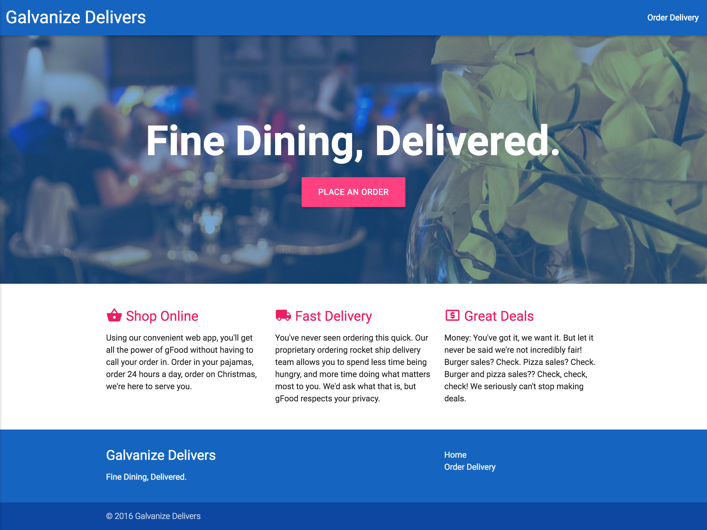
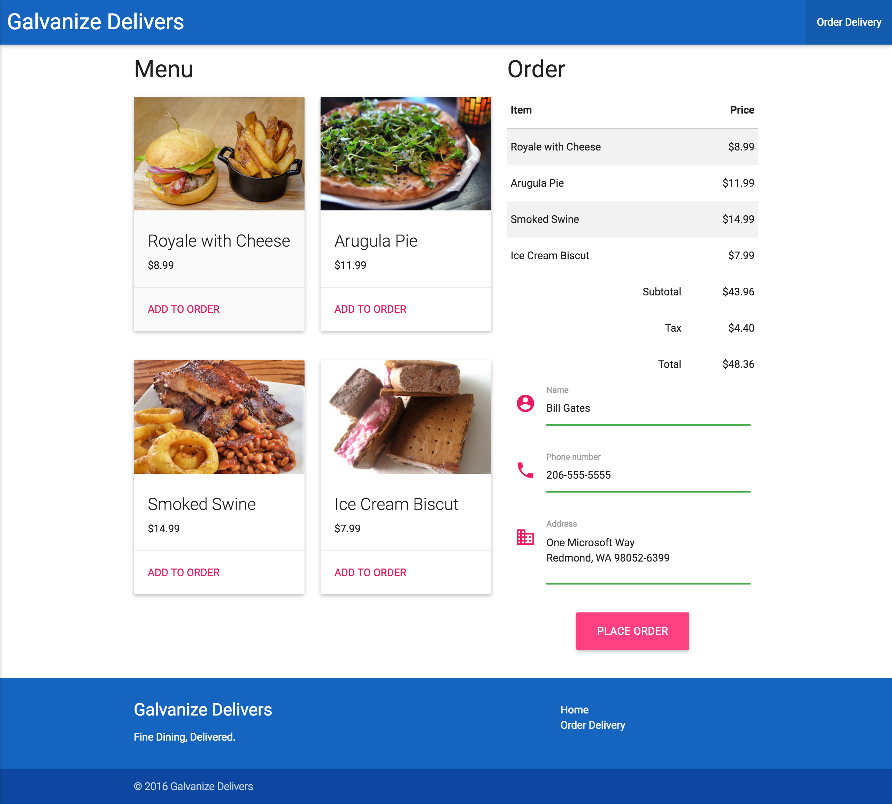

# Galvanize Delivers

In this exercise, you're tasked with creating a website for a fine dining delivery service with two pages—a landing page and an ordering page. To get started, fork and clone this repository.

## The landing page

Though you're free to style the page however you want, the page should look something like this.

More specifically, the page should allow a user to do the following.

1. Click links to both the landing and ordering pages that are left and right aligned respectively in a fixed navbar.
1. Read the service's tagline and click a call-to-action that's _roughly_ centered over a hero image in the header.
1. Read the service's marketing copy in a three-column main section.
1. Read the service's name and tagline as well as click links to both pages in a two-column footer.
1. Read the copyright information in the footer.

Here's the marketing copy for the landing page.

> Shop Online
>
> Using our convenient web app, you'll get all the power of gFood without having to call your order in. Order in your pajamas, order 24 hours a day, order on Christmas, we're here to serve you.
>
> Fast Delivery
>
> You've never seen ordering this quick. Our proprietary ordering rocket ship delivery team allows you to spend less time being hungry, and more time doing what matters most to you. We'd ask what that is, but gFood respects your privacy.
>
> Great Deals
>
> Money: You've got it, we want it. But let it never be said we're not incredibly fair! Burger sales? Check. Pizza sales? Check. Burger and pizza sales?? Check, check, check! We seriously can't stop making deals.

**TIP:** The shopping, shipping, and ATM icons are [Material Icons](https://design.google.com/icons/).

### Bonus

Tweak the landing page so it's responsive under [medium](screenshots/index_medium.png) and [small](screenshots/index_small.png) viewports.

1. Ensure that the viewport's [width and initial scale](https://developer.mozilla.org/en-US/docs/Mozilla/Mobile/Viewport_meta_tag) are appropriately set.
1. Ensure that right aligned link in the navbar collapses into a hamburger icon on medium viewports. When the hamburger icon is clicked, a [sidebar with the link](screenshots/index_medium_sidebar.png) is displayed.
1. Ensure the main section's marketing copy collapses into one-column on small viewports.
1. Read the footer's name, tagline, and links collapse into one-column on small viewports.

## The ordering page

Though you're free to style the page however you want, the page should look something like this.

More specifically, the page should allow a user to do the following.

1. Click links to both the landing and ordering pages that are left and right aligned respectively in a fixed navbar.
1. See that the ordering page is the active item in the navbar.
1. See the menu on the left side of _roughly_ half the page in a two-column card layout.
1. See the order on the right side of _roughly_ half the page with a receipt table at the top and a delivery form below.
1. Read the service's name and tagline as well as click links to both pages in a two-column footer.
1. Read the copyright information in the footer.

Using custom JavaScript, the page should also allow a user to do the following.

1. Add menu items to the receipt which updates the subtotal, tax, and total.
1. Type their information into each required textfield of the delivery form.
1. Click the button to place the order.
  - If the receipt has no menu items or any of the textfields are blank, they should see a validation message in a toast.
  - Otherwise, they should see a success message in a toast.

### Bonus

Tweak the ordering page so it's responsive under [medium](screenshots/order_medium.png) and [small](screenshots/order_small.png) viewports.

1. Ensure that the viewport's [width and initial scale](https://developer.mozilla.org/en-US/docs/Mozilla/Mobile/Viewport_meta_tag) are appropriately set.
1. Ensure that right aligned link in the navbar collapses into a hamburger icon on medium viewports. When the hamburger icon is clicked, a [sidebar with the link](screenshots/order_medium_sidebar.png) is displayed.
1. Ensure the menu's cards collapse into one-column on medium viewports.
1. Ensure the main section's menu and order collapse into one-column on small viewports.
1. Read the footer's name, tagline, and links collapse into one-column on small viewports.

## Deployment

Review the following articles on the Surge platform and then deploy your website to production.

- [Getting started with Surge](http://surge.sh/help/getting-started-with-surge)
- [Remembering a domain](http://surge.sh/help/remembering-a-domain)

A good domain name for this project is `USERNAME-galvanize-delivers.surge.sh` where `USERNAME` is your GitHub username in all **lowercase** letters. Once deployed and everything works as you expect, copy the URL to your site and paste it below.

PASTE YOUR PRODUCTION URL HERE
